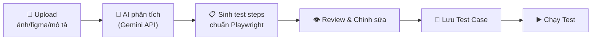

# Chức năng Tạo Test Case Tự động bằng AI

## Mô tả vấn đề

Hiện tại, khi QC/BA nhập test case (thủ công hoặc upload Excel), Playwright thường không hiểu đúng selector/action dẫn đến lỗi khi chạy. Nguyên nhân gốc: **người dùng không biết kỹ thuật** không thể viết đúng selector CSS, action type, hay giá trị phù hợp với cấu trúc DOM thực tế.

## Giải pháp

Tạo chức năng **AI Test Case Generator** — người dùng chỉ cần cung cấp ảnh chụp màn hình UI, link Figma, hoặc file mô tả nghiệp vụ → AI tự phân tích và sinh test case chuẩn Playwright. Có bước **review/chỉnh sửa** trước khi lưu và chạy.

---

## Công nghệ AI

| Tiêu chí | Lựa chọn |
|---|---|
| **AI Model** | Google Gemini 2.5 Flash (miễn phí, multimodal, hỗ trợ ảnh + text) |
| **NPM Package** | `@google/genai` (SDK mới nhất, thay thế `@google/generative-ai`) |
| **API Key** | Người dùng tự cấu hình qua Settings UI hoặc biến môi trường `GEMINI_API_KEY` |

> [!IMPORTANT]
> Cần người dùng có **Gemini API Key** (miễn phí tại [aistudio.google.com](https://aistudio.google.com)). Nếu không có key, chức năng AI sẽ disabled, các chức năng khác vẫn hoạt động bình thường.

---

## Luồng hoạt động



### Chi tiết:
1. **Người dùng** upload 1+ file: ảnh UI (PNG/JPG), text mô tả chức năng, URL trang web
2. **AI Analyzer** gửi ảnh + context đến Gemini API với prompt chuyên biệt
3. **Gemini** phân tích ảnh → nhận diện các phần tử UI (nút, input, dropdown...) → sinh JSON steps
4. **Review UI** hiển thị kết quả dạng step-by-step, người dùng có thể:
   - Sửa selector, value, expected
   - Thêm/xóa/sắp xếp lại bước
   - Chạy thử lại AI nếu kết quả chưa đúng
5. **Lưu** vào database như test case bình thường

---

## Proposed Changes

### Backend — AI Module

#### [NEW] [AITestGenerator.js](file:///e:/Test_21022026/backend/src/ai/AITestGenerator.js)

Module chính xử lý AI:
- `generateFromScreenshots(images[], context)` — phân tích ảnh UI
- `generateFromDescription(text, url)` — phân tích mô tả văn bản  
- `buildPrompt(context)` — tạo prompt chuyên biệt cho Gemini
- `parseAIResponse(response)` — parse JSON output từ AI thành steps array
- `validateSteps(steps)` — validate mỗi step có đúng format Playwright

**Prompt Engineering:** Prompt sẽ yêu cầu AI:
- Nhận diện tất cả phần tử tương tác trên UI
- Ưu tiên selector theo thứ tự: `role > data-testid > id > name > placeholder > css class`
- Output chuẩn JSON với format giống `ActionHandler.js` hỗ trợ
- Giải thích mỗi bước bằng tiếng Việt

---

#### [NEW] [ai.js](file:///e:/Test_21022026/backend/src/api/ai.js)

API endpoints:
- `POST /api/ai/generate` — nhận files + context, trả về generated steps
- `POST /api/ai/refine` — gửi lại steps + feedback, AI chỉnh sửa
- `GET /api/ai/status` — check API key configured
- `POST /api/ai/settings` — lưu API key

---

#### [MODIFY] [server.js](file:///e:/Test_21022026/backend/src/server.js)
- Import và mount route `/api/ai`

#### [MODIFY] [package.json](file:///e:/Test_21022026/backend/package.json)
- Thêm dependency `@google/genai`

---

### Frontend — AI Wizard UI

#### [NEW] [AIGenerator.jsx](file:///e:/Test_21022026/frontend/src/pages/AIGenerator.jsx)

Trang mới "🤖 Tạo TC bằng AI" gồm 3 bước wizard:

**Bước 1 — Input:**
- Khu vực drag & drop ảnh (đa ảnh, hỗ trợ PNG/JPG/WEBP)  
- Textarea nhập mô tả chức năng (VD: "Test luồng đăng nhập, nhập email và mật khẩu, nhấn nút đăng nhập, kiểm tra chuyển trang dashboard")
- Input URL trang cần test
- Dropdown chọn trình duyệt
- Dropdown chọn Suite

**Bước 2 — AI Processing:**
- Loading animation + progress hiển thị AI đang phân tích
- Hiển thị từng step được sinh ra (streaming effect)

**Bước 3 — Review & Edit:**
- Bảng steps dạng editable với các cột: #, Action, Selector, Value, Expected, Mô tả
- Inline edit trực tiếp trên bảng
- Nút thêm/xóa/di chuyển step
- Nút "🤖 AI chỉnh lại" (gửi feedback + regenerate)
- Nút "💾 Lưu Test Case" (save vào DB)
- Preview code Playwright để dev/QC xem

---

#### [MODIFY] [Layout.jsx](file:///e:/Test_21022026/frontend/src/components/Layout.jsx)
- Thêm menu item "🤖 Tạo TC bằng AI"

#### [MODIFY] [main.jsx](file:///e:/Test_21022026/frontend/src/main.jsx)
- Thêm route `/ai-generator` 

#### [MODIFY] [index.css](file:///e:/Test_21022026/frontend/src/index.css)
- CSS cho wizard, drag & drop zone, step editor, loading animation

---

### Backend — Settings

#### [NEW] [settings.js](file:///e:/Test_21022026/backend/src/api/settings.js)

API quản lý settings:
- `GET /api/settings` — lấy settings (API key masked)
- `POST /api/settings` — lưu settings (API key, default model)
- File lưu trữ: `data/settings.json`

---

## Cấu trúc Output AI

AI sẽ generate JSON theo format chuẩn của hệ thống:

```json
{
  "title": "Test đăng nhập thành công",
  "description": "Kiểm tra luồng đăng nhập với email và mật khẩu hợp lệ",
  "steps": [
    {
      "step_id": 1,
      "action": "navigate",
      "selector": "",
      "value": "https://example.com/login",
      "expected": "",
      "description": "Mở trang đăng nhập"
    },
    {
      "step_id": 2,
      "action": "fill",
      "selector": "input[name=\"email\"]",
      "value": "user@test.com",
      "expected": "",
      "description": "Nhập email vào ô Email"
    },
    {
      "step_id": 3,
      "action": "click",
      "selector": "button[type=\"submit\"]",
      "value": "",
      "expected": "",
      "description": "Nhấn nút Đăng nhập"
    },
    {
      "step_id": 4,
      "action": "assert_url",
      "selector": "",
      "value": "",
      "expected": "/dashboard",
      "description": "Kiểm tra URL chuyển đến dashboard"
    }
  ]
}
```

---

## Verification Plan

### Automated Tests
1. Unit test `AITestGenerator.js` — mock Gemini API, verify output format
2. API test `/api/ai/generate` — upload ảnh, verify response schema
3. Frontend build — verify no compilation errors

### Manual Verification
1. Upload ảnh login page → verify AI sinh đúng steps navigate, fill, click, assert
2. Upload ảnh form phức tạp → verify AI nhận diện dropdown, checkbox, radio
3. Test review flow: sửa step → lưu → chạy test thành công
4. Test khi không có API key → verify UI hiển thị hướng dẫn cấu hình
