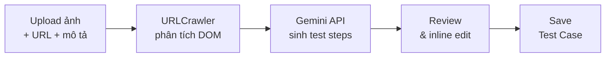

# Walkthrough: AI Test Case Generator

## Tổng quan

Tạo chức năng **AI Test Case Generator** — cho phép QC/BA upload ảnh UI, nhập URL, hoặc mô tả nghiệp vụ → AI (Google Gemini) tự động sinh test case chuẩn Playwright → review/chỉnh sửa → lưu vào DB.

## Các file đã tạo/sửa

### Backend (4 file mới, 2 file sửa)

| File | Mô tả |
|---|---|
| [AITestGenerator.js](file:///e:/Test_21022026/backend/src/ai/AITestGenerator.js) | **Core AI module** — Gemini API integration, prompt engineering, response parsing |
| [URLCrawler.js](file:///e:/Test_21022026/backend/src/ai/URLCrawler.js) | **URL crawler** — Playwright truy cập URL, phân tích DOM, trích xuất interactive elements |
| [ai.js](file:///e:/Test_21022026/backend/src/api/ai.js) | **API routes** — `/api/ai/generate`, `/refine`, `/crawl`, `/status` |
| [server.js](file:///e:/Test_21022026/backend/src/server.js) | Mount route `/api/ai` |
| [package.json](file:///e:/Test_21022026/backend/package.json) | Thêm dependency `@google/genai` |

### Frontend (3 file mới/sửa)

| File | Mô tả |
|---|---|
| [AIGenerator.jsx](file:///e:/Test_21022026/frontend/src/pages/AIGenerator.jsx) | **3-step wizard**: Input → AI Processing → Review & Edit |
| [Layout.jsx](file:///e:/Test_21022026/frontend/src/components/Layout.jsx) | Thêm nav item "Tạo TC bằng AI" |
| [App.jsx](file:///e:/Test_21022026/frontend/src/App.jsx) | Thêm route `ai-generator` |
| [index.css](file:///e:/Test_21022026/frontend/src/index.css) | CSS cho wizard, drop zone, steps table |

## Luồng hoạt động

## Cách sử dụng

1. Lấy **Gemini API Key** miễn phí tại [aistudio.google.com](https://aistudio.google.com)
2. Thêm biến môi trường: `GEMINI_API_KEY=your_key_here`
3. Restart backend: `npm run dev`
4. Truy cập sidebar → **Tạo TC bằng AI**

## Verification

- ✅ Frontend build thành công
- ✅ API `/api/ai/status` phản hồi đúng (`configured: false` khi chưa có key)
- ⏳ Test AI generation cần GEMINI_API_KEY
